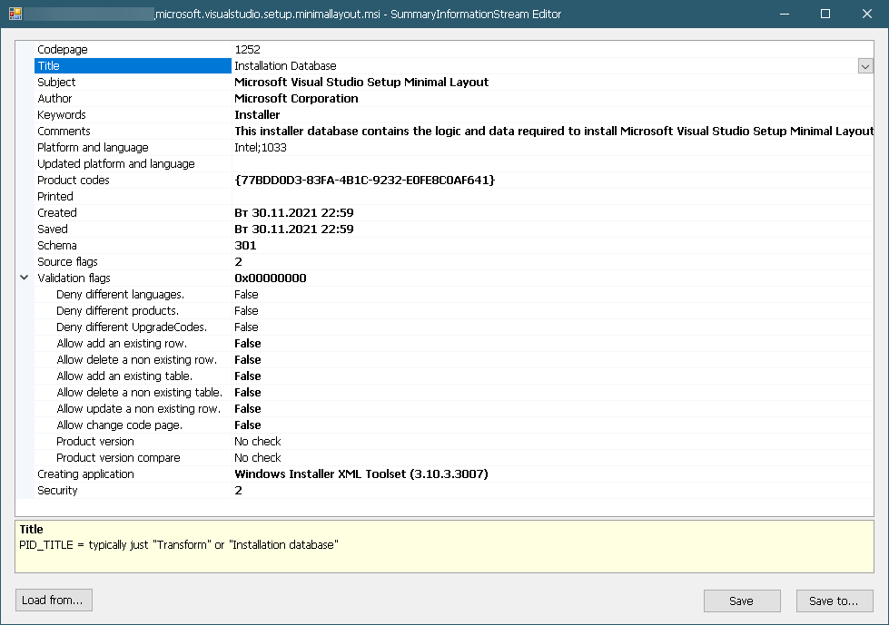

# SISEdit

A [Summary Information Stream (SIS)](https://learn.microsoft.com/en-us/windows/win32/msi/summary-information-stream) editor for the Windows Installer files.
Can edit SIS for both .msi and .mst.

